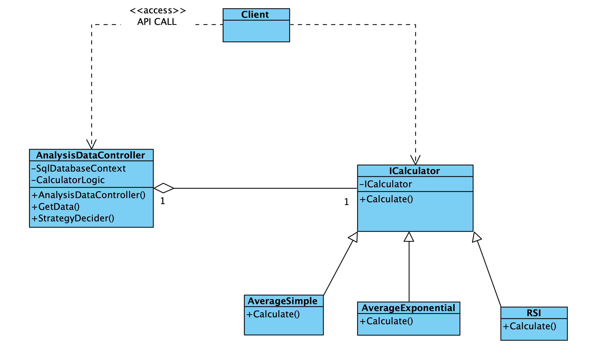
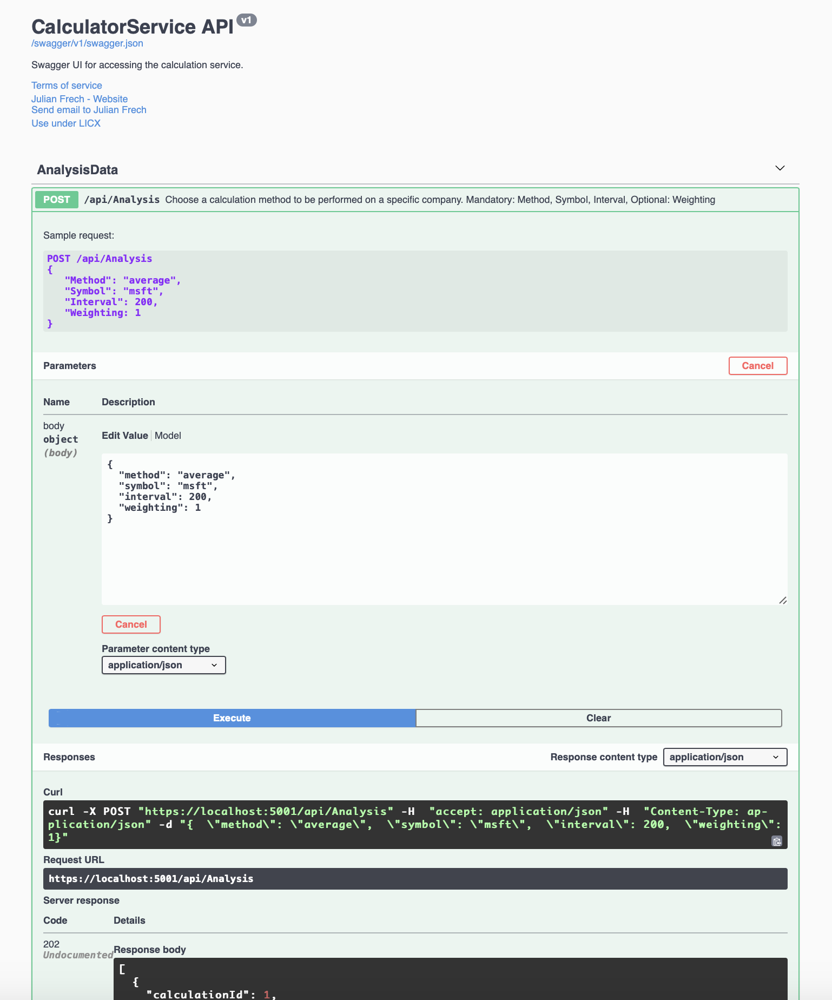

# Central Finance Manager

Multiple services and applications, database and scripts to collect financial data, perform analysis and build your own depot.

* **C#** is used as main language, supporting native hosting in **MS Azure** and providing professional documentation.
* When necessary **Python 3.8** is used for data analysis.
* The web application UI is based upon the new **Blazor** design and therefore **Javascript** and **HTML5** are used only when necessary.
* Due to **Blazor** most if not even all Javascript can be substituted by **C#**.
* It remains to be clearified if **Python** can be substituted by **F#**.

## Components Overview

1. [FinanceBro](https://github.com/julian-frech/CodeExampleFB/tree/master/DOTNET/FinanceBro) 
2. [MarketDataService](https://github.com/julian-frech/CodeExampleFB/tree/master/DOTNET/MarketDataService) 
3. [Fct_HTTP_Trigger](https://github.com/julian-frech/CodeExampleFB/tree/master/DOTNET/Fct_HTTP_Trigger) 
4. [CalculatorService](https://github.com/julian-frech/CodeExampleFB/tree/NewReadMe/DOTNET/CalculatorService)
5. [FinanceBroGraphQL](https://github.com/julian-frech/CodeExampleFB/tree/master/DOTNET/FinanceBroGraphQL)

## Introduction

[FinanceBro](https://github.com/julian-frech/CodeExampleFB/tree/master/DOTNET/FinanceBro) is the web user interface. It can be used to trigger services, display financial data and mainly to create user accounts and user depots. Currently it runs as **Server-App** application, later it will be changed to **Webassembly-App** for the benefit of moving load from Azure host to the client browser and using [SignalR](https://docs.microsoft.com/de-de/aspnet/core/tutorials/signalr-blazor-webassembly?view=aspnetcore-3.1&tabs=visual-studio-mac).
Market data is consumed via [MarketDataService](https://github.com/julian-frech/CodeExampleFB/tree/master/DOTNET/MarketDataService). Currently only [IEXCloud](https://iexcloud.io) is connected.  Before [BoersenDatenService2](https://github.com/julian-frech/CodeExampleFB/tree/NewReadMe/DOTNET/BoersenDatenService2/BoersenDatenService1) with a abstract factory pattern was used to connect various market data sources. Since one source can deliver much more information, it was not developed any further. [Fct_HTTP_Trigger](https://github.com/julian-frech/CodeExampleFB/tree/master/DOTNET/Fct_HTTP_Trigger) is an Azure Function triggered via API and in parallel also as crontab service.  
[CalculatorService](https://github.com/julian-frech/CodeExampleFB/tree/NewReadMe/DOTNET/CalculatorService) implements various finance functions like relative-strength index and can be accessed via API. Due to the nature of various algorithms that need to be implemented the **strategy pattern** is used. ICalculator is the Interface for various concrete strategies. The API controller class (context) processes which concrete strategy needs to be implemented depending on the client input. The API is only depending on ICalculator. The client is in direct association to the **context** and indirect association with the **interface**. 
[Azure Data Factory](https://azure.microsoft.com/de-de/services/data-factory/) is used as ETL and ELT tool. It is currently decomissioned because of pricing. 

# Component Design

1. [CalculatorService](https://github.com/julian-frech/CodeExampleFB#calculatorservice)
2. [FinanceBroGraphQL](https://github.com/julian-frech/CodeExampleFB#financebrographql)

## CalculatorService

The CalculatorService is a simple strategy pattern. Main Nuggets used are: 
[EFCore.BulkExtensions](https://github.com/borisdj/EFCore.BulkExtensions) and [Microsoft.EntityFrameworkCore](https://www.nuget.org/packages/Microsoft.EntityFrameworkCore). CalculatorService implements a REST API with swagger UI and xml documentation. Mainly because I am to lazy to program a dispatcher service yet.

### New features: 

1. Debugging: [NLog](https://nlog-project.org)
2. User Interface: [Swagger UI](https://docs.microsoft.com/de-de/aspnet/core/tutorials/getting-started-with-swashbuckle?view=aspnetcore-3.1&tabs=visual-studio-mac) 

### Missing Features
1. Http Error handling + Middleware: [ProblemDetailsFactory](https://docs.microsoft.com/en-us/aspnet/core/web-api/handle-errors?view=aspnetcore-3.1#client-error-response) 
The [DefaultProblemDetailsFactory](https://github.com/dotnet/aspnetcore/blob/master/src/Mvc/Mvc.Core/src/Infrastructure/DefaultProblemDetailsFactory.cs) is provided and can be customized. The MS documentation is missing a description for the Exception method.

## FinanceBroGraphQL
The FinanceBroGraphQL is a GraphQL API based on [HotChocolate](https://github.com/ChilliCream/hotchocolate) and also the first application based on the new [.NET 5.0](https://docs.microsoft.com/en-us/dotnet/core/dotnet-five), which is the successor also of the .NET Core framework. Thus, the .NET Core and .NET Framework should finally be dropped. One needs to take into consideration the following: "ASP.NET Core 5.0 is based on .NET 5.0 but retains the name "Core" to avoid confusing it with ASP.NET MVC 5. Likewise, Entity Framework Core 5.0 retains the name "Core" to avoid confusing it with Entity Framework 5 and 6."

# Design and Features

The Options pattern in [ASP.NET Core](https://docs.microsoft.com/en-us/aspnet/core/fundamentals/configuration/options?view=aspnetcore-3.1) enables usage of strongly typed access to settings. Depdening on the scenario applied the configuration is isolated into separate classes. 
This leads to conformity with the [Interface Segregation Principle](https://docs.microsoft.com/en-us/dotnet/architecture/modern-web-apps-azure/architectural-principles#encapsulation): 
1. Decouple not needed modules (unnecessary dependencies)
     1. No need to recompile if i.e. launchsettings change.

Brief example:  
